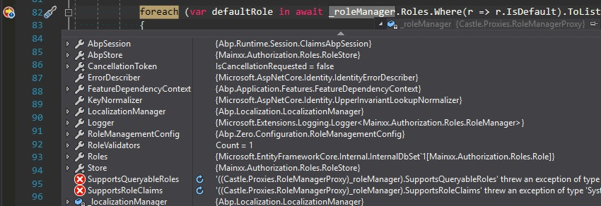

### 在领域事件中调用UserRegistrationManager.RegisterAsync抛异常

**Call UserRegistrationManager.RegisterAsync() throw exception in a domain event**

```C#
//在github请求帮助之前.
//
//先去：https://stackoverflow.com/questions/tagged/aspnetboilerplate 看看有没有相应的问题
public class EventCreateUser : MainxxDomainServiceBase, IEventHandler<Records.Events.AddUserRecordEventData>, ITransientDependency
{
    private readonly UserRegistrationManager _userRegistrationManager;
    private readonly IUnitOfWorkManager _unitOfWorkManager;

    public EventCreateUser(
        IUnitOfWorkManager unitOfWorkManager,
    UserRegistrationManager userRegistrationManager)
    {
        _userRegistrationManager = userRegistrationManager;
        _unitOfWorkManager = unitOfWorkManager;
    }
    public async void HandleEvent(AddUserRecordEventData eventData)
    {
        var user = await _userRegistrationManager.RegisterAsync(
                    eventData.AddUserRecordData.UserName,
                    eventData.AddUserRecordData.UserName,
                    eventData.AddUserRecordData.UserName + "@test.core",
                    eventData.AddUserRecordData.UserName,
                    eventData.AddUserRecordData.Password,
                    true, null);
    }
}
```


> Error Massage


```text
System.ObjectDisposedException
  HResult=0x80131622
  Message=Cannot access a disposed object. A common cause of this error is disposing a context that was resolved from dependency injection and then later trying to use the same context instance elsewhere in your application. This may occur if you are calling Dispose() on the context, or wrapping the context in a using statement. If you are using dependency injection, you should let the dependency injection container take care of disposing context instances.Cannot access a disposed object. A common cause of this error is disposing a context that was resolved from dependency injection and then later trying to use the same context instance elsewhere in your application. This may occur if you are calling Dispose() on the context, or wrapping the context in a using statement. If you are using dependency injection, you should let the dependency injection container take care of disposing context instances.
  Source=Microsoft.EntityFrameworkCore
  StackTrace:
   at Microsoft.EntityFrameworkCore.DbContext.CheckDisposed()
   at Microsoft.EntityFrameworkCore.DbContext.get_DbContextDependencies()
   at Microsoft.EntityFrameworkCore.DbContext.get_Model()
   at Microsoft.EntityFrameworkCore.Internal.InternalDbSet`1.get_EntityType()
   at Microsoft.EntityFrameworkCore.Internal.InternalDbSet`1.get_EntityQueryable()
   at Microsoft.EntityFrameworkCore.Internal.InternalDbSet`1.System.Linq.IQueryable.get_Provider()
   at System.Linq.Queryable.Where[TSource](IQueryable`1 source, Expression`1 predicate)
   at Mainxx.Authorization.Users.UserRegistrationManager.<RegisterAsync>d__13.MoveNext() in S:\Gitee\Mainxx\aspnet-core\src\Mainxx.Core\Authorization\Users\UserRegistrationManager.cs:line 82
   at System.Runtime.ExceptionServices.ExceptionDispatchInfo.Throw()
   at System.Runtime.CompilerServices.TaskAwaiter.HandleNonSuccessAndDebuggerNotification(Task task)
   at System.Runtime.CompilerServices.TaskAwaiter`1.GetResult()
```

## 解决方案：

Github issuse:<https://github.com/aspnetboilerplate/aspnetboilerplate/issues/3544#issuecomment-399766719>

* Add [UnitOfWork] attribute.
* Make method virtual.
* Implement IAsyncEventHandler if async.
* [UnitOfWork]
* public virtual async Task HandleEventAsync(AddUserRecordEventData eventData)