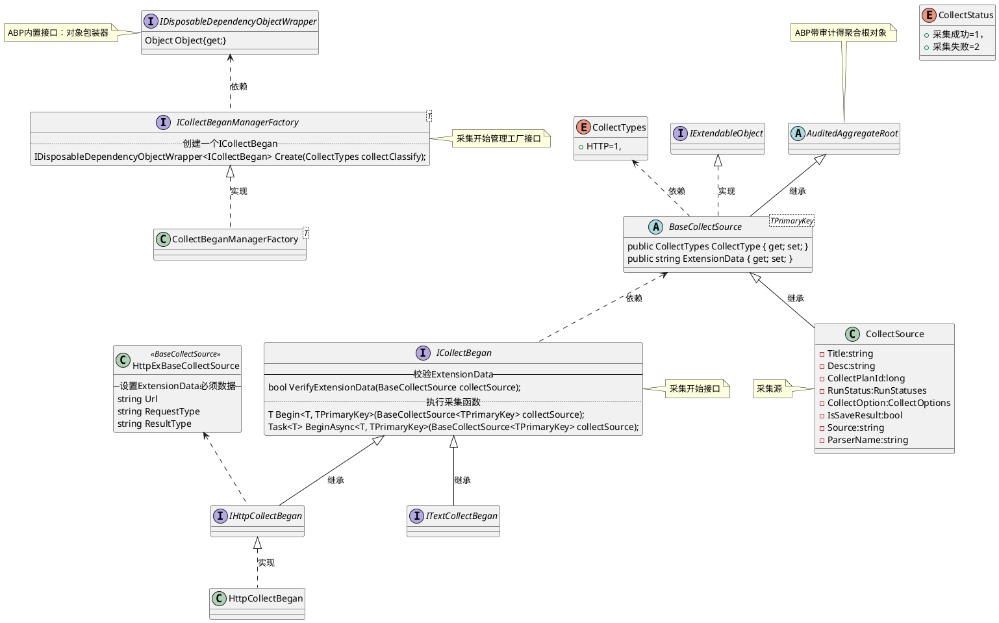
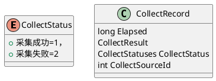
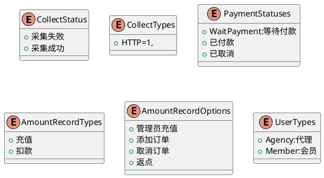
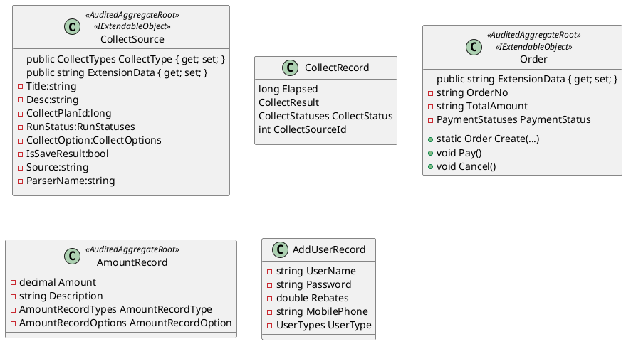

# Collect设计_UML学习之路

```plantuml

@startuml
interface  ICollectBeganManagerFactory<T>{
   ..创建一个ICollectBegan..
   IDisposableDependencyObjectWrapper<ICollectBegan> Create(CollectTypes collectClassify);
}
note right:采集开始管理工厂接口

interface IDisposableDependencyObjectWrapper{
    Object Object{get;}
}
note left of IDisposableDependencyObjectWrapper:ABP内置接口：对象包装器

IDisposableDependencyObjectWrapper <.. ICollectBeganManagerFactory : 依赖

class CollectBeganManagerFactory<T>

ICollectBeganManagerFactory <|.. CollectBeganManagerFactory : 实现

interface ICollectBegan{
    --校验ExtensionData--
    bool VerifyExtensionData(BaseCollectSource collectSource);
    ..执行采集函数..
    T Begin<T, TPrimaryKey>(BaseCollectSource<TPrimaryKey> collectSource);
    Task<T> BeginAsync<T, TPrimaryKey>(BaseCollectSource<TPrimaryKey> collectSource);
}
note right:采集开始接口

enum CollectTypes{
    + HTTP=1,
}

abstract class BaseCollectSource<TPrimaryKey>{
    public CollectTypes CollectType { get; set; }
    public string ExtensionData { get; set; }
}
interface IExtendableObject
abstract class AuditedAggregateRoot
CollectTypes <.. BaseCollectSource : 依赖
AuditedAggregateRoot <|-- BaseCollectSource : 继承
IExtendableObject <|.. BaseCollectSource : 实现
BaseCollectSource <..  ICollectBegan : 依赖

note top of AuditedAggregateRoot:ABP带审计得聚合根对象


interface IHttpCollectBegan{
}
ICollectBegan <|--  IHttpCollectBegan : 继承

interface ITextCollectBegan
ICollectBegan <|--  ITextCollectBegan : 继承

IHttpCollectBegan <|.. HttpCollectBegan : 实现

class HttpExBaseCollectSource  <<BaseCollectSource>> {
    --设置ExtensionData必须数据--
    string Url
    string RequestType
    string ResultType
}

HttpExBaseCollectSource <.. IHttpCollectBegan

class CollectSource{
- Title:string
- Desc:string
- CollectPlanId:long
- RunStatus:RunStatuses
- CollectOption:CollectOptions
- IsSaveResult:bool
- Source:string
- ParserName:string
}
note left of CollectSource
     采集源
end note

BaseCollectSource <|-- CollectSource : 继承

enum CollectStatus{
    + 采集成功=1，
    + 采集失败=2
}

@enduml
```

<!-- 
> 采集记录

```plantuml
@startuml
enum CollectStatus{
    + 采集成功=1，
    + 采集失败=2
}
class  CollectRecord{
    long Elapsed
    CollectResult
    CollectStatuses CollectStatus
    int CollectSourceId
}
@enduml
```
-->

> 管理枚举

```plantuml
@startuml
enum CollectStatus{
    + 采集失败
    + 采集成功
}
enum CollectTypes{
    + HTTP=1,
}
enum PaymentStatuses{
    + WaitPayment:等待付款
    + 已付款
    + 已取消
}
enum AmountRecordTypes{
    + 充值
    + 扣款
}
enum AmountRecordOptions{
    + 管理员充值
    + 添加订单
    + 取消订单
    + 返点
}
enum UserTypes{
    + Agency:代理
    + Member:会员
}
@enduml
```

> 管理实体

```plantuml
@startuml
class CollectSource<<AuditedAggregateRoot>><<IExtendableObject>>{
    public CollectTypes CollectType { get; set; }
    public string ExtensionData { get; set; }
    - Title:string
    - Desc:string
    - CollectPlanId:long
    - RunStatus:RunStatuses
    - CollectOption:CollectOptions
    - IsSaveResult:bool
    - Source:string
    - ParserName:string
}
class  CollectRecord{
    long Elapsed
    CollectResult
    CollectStatuses CollectStatus
    int CollectSourceId
}
class Order<<AuditedAggregateRoot>><<IExtendableObject>>{
    public string ExtensionData { get; set; }
    - string OrderNo
    - string TotalAmount
    - PaymentStatuses PaymentStatus
    + static Order Create(...)
    + void Pay()
    + void Cancel()
}
class AmountRecord<<AuditedAggregateRoot>>{
    - decimal Amount
    - string Description
    - AmountRecordTypes AmountRecordType
    - AmountRecordOptions AmountRecordOption
}
class AddUserRecord{
    - string UserName
    - string Password
    - double Rebates
    - string MobilePhone
    - UserTypes UserType
}
@enduml
```
