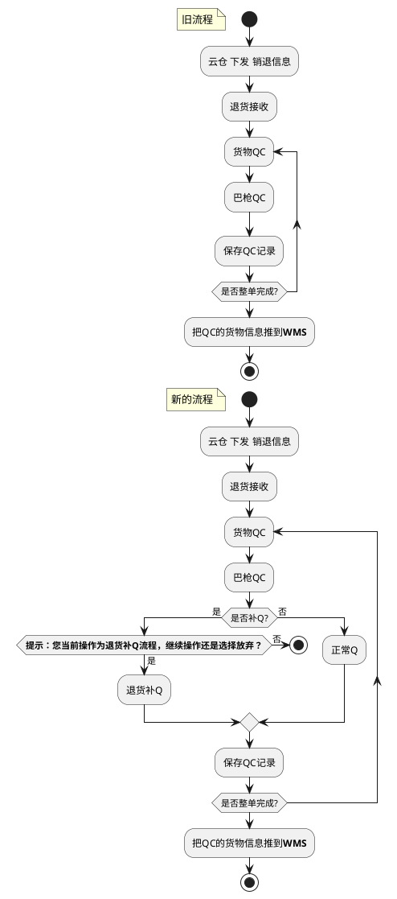
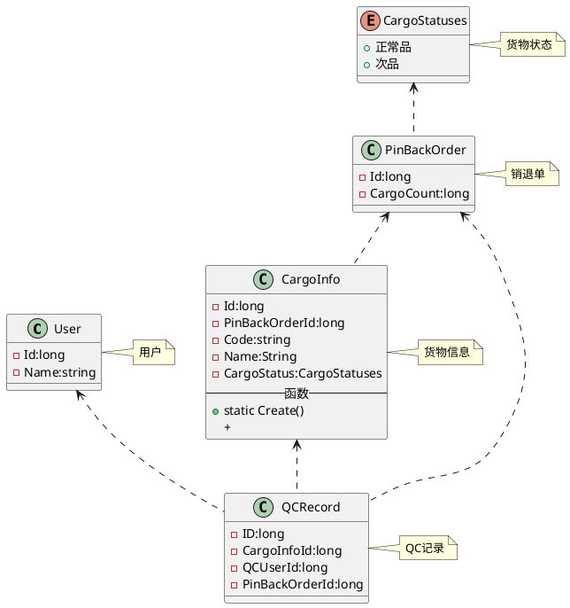

# 测试实战

## 实战

TDD:NSubstitute

```bash
PM> Install-Package SpecFlow.xUnit
PM> Install-Package xunit.runner.visualstudio
PM> Install-Package Shouldly
```

* [SpecFlow.xUnit] :基于xUnit的SpecFlow,定义、管理和自动执行人类可读的验收测试。编写易于理解的测试是BDD范式的基础，同时也有助于构建您的系统的活文档。是[Cucumber]家族的一部分.
* xunit.runner.visualstudio :**xUnit.net**框架的测试资源管理器
* [Shouldly] :非常不错的断言框架

[Cucumber]:(https://cucumber.io/)
[Shouldly]:(http://docs.shouldly-lib.net/)
[SpecFlow.xUnit]:(https://specflow.org/)

原需求：


例子：**QC退货可以补Q**

```text
来自TAPD
Title:QC退货可以补Q
时间：2018/4/10
提出人：康强
需求描述：针对于各仓多次出现销退单提前点击完成，导致后续不能继续退货QC，提出补Q的需求；
逻辑如下：
一、是否为补Q（2次or2次以上）
a、否，则正常退货QC（即第一次退货QC）；
b、是，则提示验证是否为管理账号；
c、是，则提示：“您当前操作为退货补Q流程，继续操作还是选择放弃？”，点击确定或回车即可正常退货补Q，鼠标点击取消则取消操作；
d、否，则提示：“您当前账号非管理账号，请联系QC管理进行退货补Q，谢谢！”

二、第二次退货QC，传云仓明细，需按照第二次的QC的明细来传，给WMS的入库任务也是按照第二次QC的明细生成，即不会覆盖第一次的明细，以此类推；

三、巴枪退货接收，本地库会给WMS插进一条pono，去掉之前的pono，换为：“退供单号+三位流水号的形式，例：退货单号+001” ，那么二次退货补Q即为：“退货单号+002”，第三次退货补Q即为：“退货单号+003”，以此类推。
```

活动图



