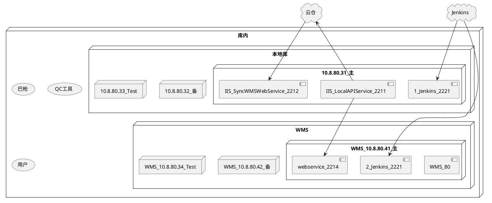

# 库内关系图

```plantuml
@startuml
node 库内{
    node 本地库{
        node 10.8.80.31_主{
                component IIS_LocalAPIService_2211
                component IIS_SyncWMSWebService_2212
                component 1_Jenkins_2221
            }
        node 10.8.80.32_备
        node 10.8.80.33_Test
        }
    node WMS{
        node WMS_10.8.80.41_主{
            component WMS_80
            component webservice_2214
            component 2_Jenkins_2221
        }
        node WMS_10.8.80.42_备
        node WMS_10.8.80.34_Test
    }
    usecase 巴枪
    usecase QC工具
    usecase 用户
}
cloud 云仓
cloud Jenkins


IIS_LocalAPIService_2211 --> 云仓
云仓 --> IIS_SyncWMSWebService_2212
Jenkins --> 1_Jenkins_2221
Jenkins --> 2_Jenkins_2221
IIS_LocalAPIService_2211 --> webservice_2214
@enduml
// QC工具 --> IIS_LocalAPIService_2211
// 巴枪 --> IIS_LocalAPIService_2211
// 巴枪 --> webservice_2214
```