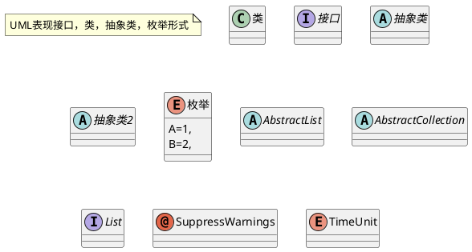
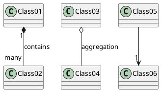
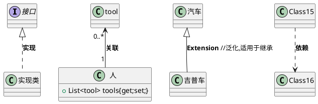
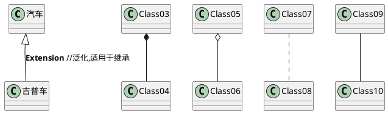
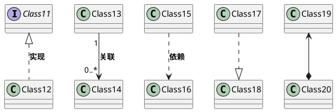
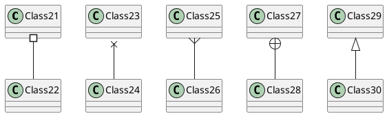

# 使用plantuml例子

PlantUML官网：<http://plantuml.com>

## UML表现



## 类图

```plantuml
类名 <|-- 类名2
class 类名{
  ..静态..
  {static} String id
  ..
  string Name
  __
  Task<int>  methods()
  -void private()
  #void protected()
  ~void packagePrivate()
  +void public()
  --抽象--
  {abstract} void methods()
}
class 类名2{
  ..静态..
  {static} String id
  ..
  string Name
  __
  Task<int>  methods()
  -void private()
  #void protected()
  ~void packagePrivate()
  +void public()
  --抽象--
  {abstract} void methods()
}
```

> asdasdv



### 关系描述



### 箭头描述








```plantuml
@startuml
class Object << general >>
Object <|--- ArrayList

note top of Object : In java, every class\nextends this one.

note "This is a floating note" as N1
note "This note is connected\nto several objects." as N2
Object .. N2
N2 .. ArrayList

class Foo
note left: On last defined class

@enduml